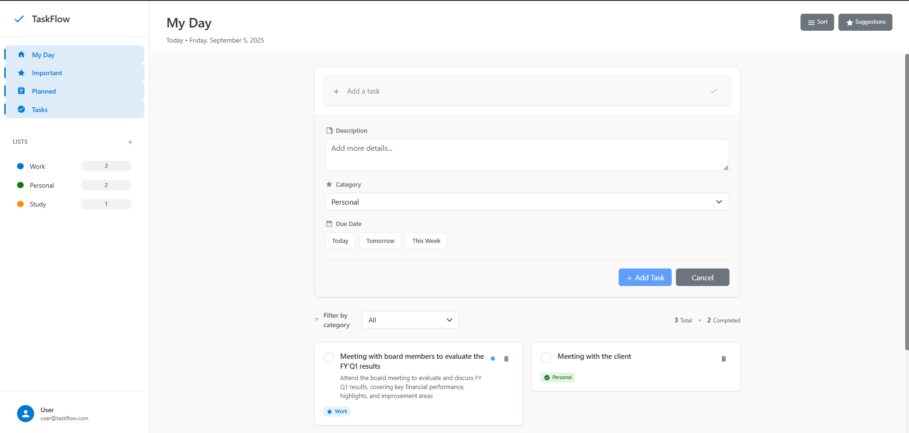

# 📝 Angular Todo List

<div align="center">
  
  
  [](https://angular.io/)
  [](https://nodejs.org/)
  [](https://mongodb.com/)
  [](https://getbootstrap.com/)
  [](https://www.typescriptlang.org/)
</div>

<p align="center">
  <strong>A modern, full-stack todo list application built with Angular 20 and Node.js</strong>
</p>

<p align="center">
  This project features a clean, responsive UI with Bootstrap and a robust backend API with MongoDB integration.
</p>

---

## ✨ Features

<table>
  <tr>
    <td>📋</td>
    <td><strong>CRUD Operations</strong><br/>Create, Read, Update, and Delete todos with ease</td>
  </tr>
  <tr>
    <td>🏷️</td>
    <td><strong>Category Management</strong><br/>Organize tasks by Work, Personal, Study, Today, This Week</td>
  </tr>
  <tr>
    <td>✅</td>
    <td><strong>Toggle Completion</strong><br/>Mark tasks as complete/incomplete with a single click</td>
  </tr>
  <tr>
    <td>📱</td>
    <td><strong>Responsive Design</strong><br/>Works seamlessly across desktop, tablet, and mobile devices</td>
  </tr>
  <tr>
    <td>⚡</td>
    <td><strong>Real-time Updates</strong><br/>Instant synchronization across all client instances</td>
  </tr>
  <tr>
    <td>💾</td>
    <td><strong>MongoDB Persistence</strong><br/>Reliable data storage with MongoDB</td>
  </tr>
  <tr>
    <td>🎨</td>
    <td><strong>Modern UI/UX</strong><br/>Clean, intuitive interface with smooth animations</td>
  </tr>
  <tr>
    <td>🛣️</td>
    <td><strong>Angular Router</strong><br/>Smooth client-side navigation</td>
  </tr>
</table>

---

## 🛠️ Tech Stack

### 🎨 Frontend
<div>
  
  
  
  
</div>

- **Angular 20** - Modern web framework with latest features
- **TypeScript** - Type-safe JavaScript for better development experience
- **Bootstrap 5** - Responsive CSS framework for mobile-first design
- **Angular Router** - Client-side routing for seamless navigation

### ⚙️ Backend
<div>
  
  
  
  
</div>

- **Node.js** - JavaScript runtime for server-side development
- **Express.js** - Fast, unopinionated web framework
- **MongoDB** - Flexible NoSQL database
- **Mongoose** - Elegant MongoDB object modeling

---

## 🚀 Quick Start

### 📋 Prerequisites

Before you begin, ensure you have the following installed:

-  (v18 or higher)
-  (local installation or cloud instance)
- 

### 💻 Installation

#### 1️⃣ **Clone the repository**
```bash
git clone https://github.com/AvaneeshGarg/Angular-To-do-List.git
cd Angular-To-do-List
```

#### 2️⃣ **Install frontend dependencies**
```bash
npm install
```

#### 3️⃣ **Install backend dependencies**
```bash
cd backend
npm install
cd ..
```

#### 4️⃣ **Set up environment variables**
```bash
cd backend
cp .env.example .env
# Edit .env with your MongoDB connection string
```

#### 5️⃣ **Start the backend server**
```bash
cd backend
npm start
# 🚀 Server runs on http://localhost:3000
```

#### 6️⃣ **Start the Angular development server**
```bash
ng serve
# 🌐 Application runs on http://localhost:4200
```

> 🎉 **Success!** Your Angular Todo List application is now running!

---

## 📁 Project Structure

```
angular-todo-list/
├── 📁 src/
│   ├── 📁 app/
│   │   ├── 📁 MyComponent/
│   │   │   ├── 📄 about/          # About page component
│   │   │   ├── ➕ add-todo/       # Add todo component
│   │   │   ├── 📋 to-dos/         # Todo list component
│   │   │   └── 📝 todo-item/      # Individual todo item
│   │   ├── 📁 services/
│   │   │   └── 🔧 todo.service.ts # Todo service for API calls
│   │   └── ...
│   └── ...
├── 📁 backend/
│   ├── 🖥️ server.js              # Express server
│   ├── 📦 package.json           # Backend dependencies
│   └── ...
├── 📁 public/
│   └── 🖼️ image.png              # Application interface screenshot
└── ...
```

---

## 🔌 API Endpoints

| Method | Endpoint | Description | Status |
|--------|----------|-------------|---------|
| `GET` | `/api/todos` | Get all todos | ✅ |
| `POST` | `/api/todos` | Create a new todo | ✅ |
| `PUT` | `/api/todos/:id` | Update a todo | ✅ |
| `DELETE` | `/api/todos/:id` | Delete a todo | ✅ |
| `PATCH` | `/api/todos/:id/toggle` | Toggle todo completion | ✅ |

---

## 🧪 Development

### 🔍 Running Tests
```bash
# Run unit tests
ng test

# Run backend tests (if implemented)
cd backend && npm test
```

### 🏗️ Building for Production
```bash
# Build frontend
ng build
# The build artifacts will be stored in the `dist/` directory
```

### 🔧 Environment Variables

Create a `.env` file in the backend directory:

```env
PORT=3000
MONGODB_URI=mongodb://localhost:27017/todolist
NODE_ENV=development
```

---
